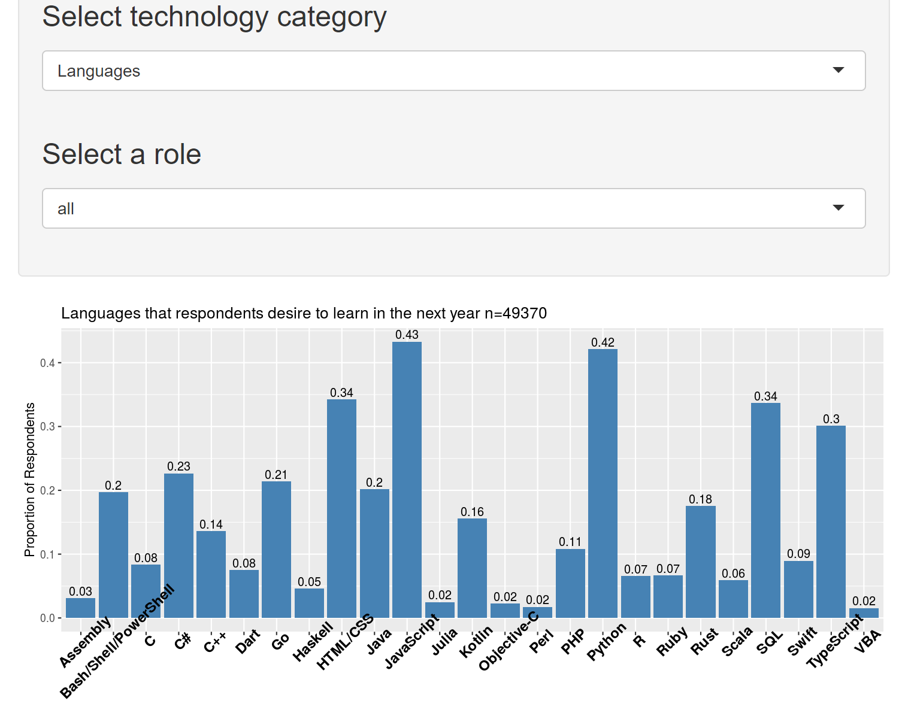
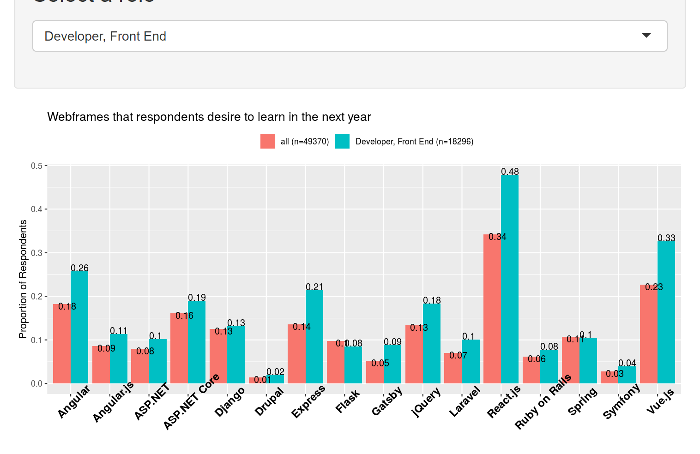

# R-Shiny + StackOverflow (2020)

This repo is for an R-Shiny application for exploring data from the 2020 StackOverflow user-survey. The application allows the user to explore from over 40,000 respondents, categorized into 22 professional roles (where development is part of their job). In particular, we can explore the respondents' desires to learn over 100 different development technologies. 

## Table of Contents
+ [Introduction](#introduction)
+ [Technologies](#technologies)
+ [Challenges](#challenges)
+ [Preview](#Preview?)

## Introduction

Shiny is an R library that allows you to create interactive web apps with R. Combining Shiny with R's other packages, the user can graphically explore data and visually uncover trends. This project was done as an exploratory tool for me and other developers. Specifically, which technologies in the 'development' field were people excited about and want to learn? Furthermore, which type of professionals (front-end devs, database admins, data scientists, etc). are excited about these technologies, and how do they compare to all developers as a whole?

## Technologies

- [Shiny](https://shiny.rstudio.com/) 
- [ggplot2](https://www.r-graph-gallery.com/ggplot2-package.html) (a library for creating awesome graphs)

## Challenges

## Preview

Below you will see some screenshots and a quick walkthrough of the app's functionality.

The graph displays the proportion of respondents of who indicated they 'would like to learn more about' the given technology within the next year. The total number of respondents is indicated in the title (n = 49370). The current category of technologies is programming languages and we are currently viewing results from ALL developer roles (as opposed to only front-end, or back-end, etc).

Now let's change the technology to webframe technologies... and the developer role to 'front-end developer'.

Now the graph has bar-pairs comparing all respondents (regardless of stated role), and respondents that indicated their role as front-end development. For example, 14% of all respondents indicated wanting to learn more about Express in the next year, compared 21% of front-end developers. Also notice that we can see the totals for both categories in the legend. 
